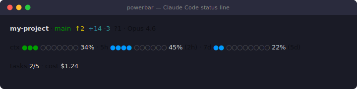

# powerbar

A rich status line for [Claude Code](https://docs.anthropic.com/en/docs/claude-code) that shows git info, context window usage, rate limits with pace tracking, and task progress — all in your terminal.

<p align="center">
  
</p>

## What you get

- **Project & git** — branch, ahead/behind, diff stats, untracked files
- **Context window** — dot bar with gradient coloring (green → yellow → red)
- **Rate limits** — 5-hour and 7-day usage with pace-aware coloring (blue = under pace, green → red = over pace) and countdown to reset
- **Tasks** — completed / total count
- **Build/verify progress** — a live `⚙ label ●●●●●○○○ 7/11 12s` bar for long-running commands, fed by the bundled `pbrun` wrapper (see below)
- **Adaptive layout** — single line when minimal, two lines when rate limits, tasks, or a live build are present

## Install

```bash
git clone https://github.com/sigmadeltasoftware/powerbar.git
cd powerbar
./install.sh
```

This copies `powerbar.py` to `~/.claude/` and configures the `statusLine` setting in `~/.claude/settings.json`. Restart Claude Code to activate.

### Manual install

```bash
cp powerbar.py ~/.claude/powerbar.py
```

Add to `~/.claude/settings.json`:

```json
{
  "statusLine": {
    "type": "command",
    "command": "python3 ~/.claude/powerbar.py"
  }
}
```

## Live build/verify progress (`pbrun`)

Long builds and test/verify runs go silent for minutes — you can't tell "stuck" from "working".
`pbrun` wraps such a command, streams its output unchanged, and publishes `[N/M]` progress to
`~/.claude/progress.json`, which powerbar renders live:

```
ctx ●●●●○○○○○○ 42%  ·  ⚙ verify hydra-core ●●●●●○○○ 7/11 12s
```

```bash
# Any command that prints [i/N] markers (e.g. `synapse verify-proofs` streams [7/11] …):
python3 ~/.claude/pbrun.py --label "verify hydra-core" -- synapse verify-proofs --flow hydra-core --jobs 6

# No markers? You still get the label + elapsed time (an indeterminate spinner):
python3 ~/.claude/pbrun.py --label "build" -- cargo test -p hydra-core
```

The file is written atomically and removed on exit; powerbar also ignores any progress file
older than 60s, so a crashed run never leaves a phantom bar. Any tool can drive the segment by
writing `{label, done, total, started, ts}` to `~/.claude/progress.json`.

> **Live ticking needs `refreshInterval`.** By default Claude Code only re-renders the status line
> on events (new message, tool start/finish), so during a single long command it *freezes*. The
> installer sets `"refreshInterval": 1000` on the `statusLine` config (Claude Code ≥ 2.1.97), which
> re-runs the script every second so the progress bar keeps advancing throughout the command. The
> transcript area itself can't be driven by an external process — the status line is the only live
> surface — so this is what makes per-second progress actually move.

## Requirements

- Python 3.6+
- Git (for branch/diff info)
- A terminal with true color support (most modern terminals)

## How it works

Claude Code pipes JSON status data to the configured command via stdin. `powerbar.py` parses this and outputs ANSI-colored text. The dot bars use Unicode circles (`●` / `○`) with 24-bit color codes.

**Pace tracking**: Rate limit bars compare your current usage against where you *should* be given the time elapsed in the window. If you're under pace, the bar is blue. As you exceed pace, it shifts green → yellow → red.

## License

MIT
